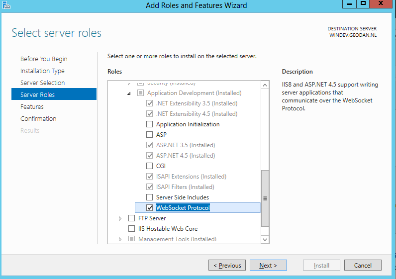
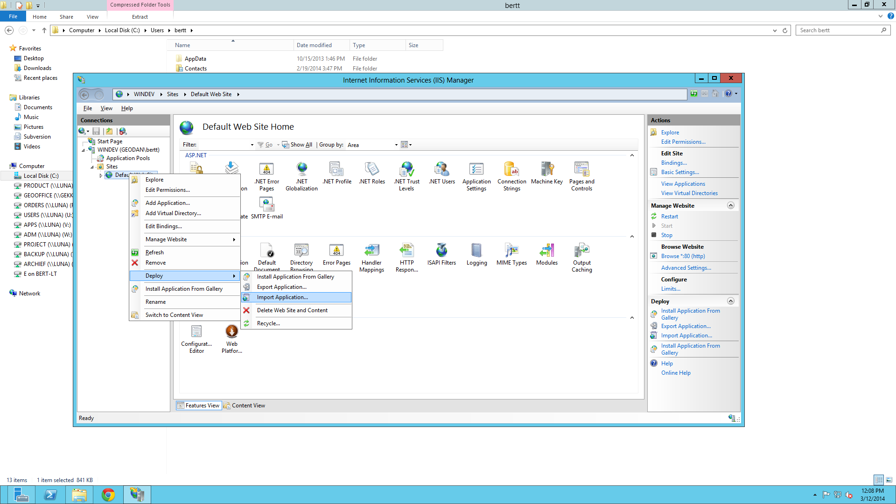
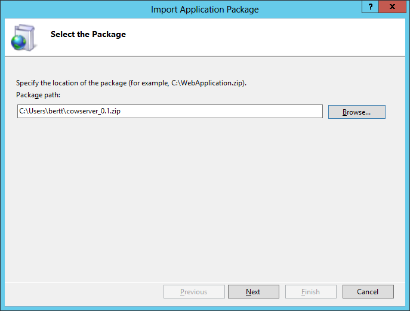
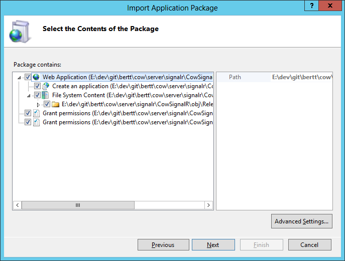
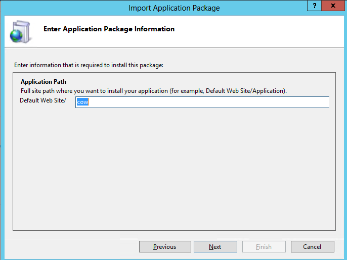
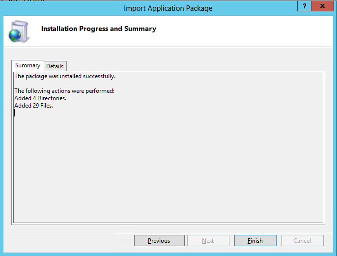

# COW Server installation #

For installation of COW Server there are two options:

- running on IIS

- running on Selfhost

## Running on IIS ##
Prerequisites:

. Microsoft.NET Framework 4.5 is installed

. IIS is installed

. Web Deploy is installed (http://www.iis.net/downloads/microsoft/web-deploy)

. Optional for IIS 8/Windows Server 2012: Web sockets role is enabled (http://www.iis.net/learn/get-started/whats-new-in-iis-8/iis-80-websocket-protocol-support

Input: File cowserver_0.1_iis.zip

Installation:

1] IIS Manager

Go to ‘default web site’ -> right click -> Deploy -> Import Application

next

next

next

finish

The files are installed under: C:\inetpub\wwwroot\cow

2] Test

Go to http://localhost/cow/cowhub.html

## Running on Self Host ##

Prerequisites:

. Microsoft.NET Framework 4.5 is installed

Input: File cowserver_0.1_selfhost.zip

Installation:

1] Unzip the zip file

2] Start CowServer.exe

Optional startup parameter: 

Cowserver.exe --help : show help

Cowserver.exe -p --port : running on different port

3] Test

Go to http://localhost:8089/cowhub.html
